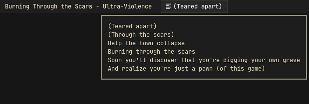
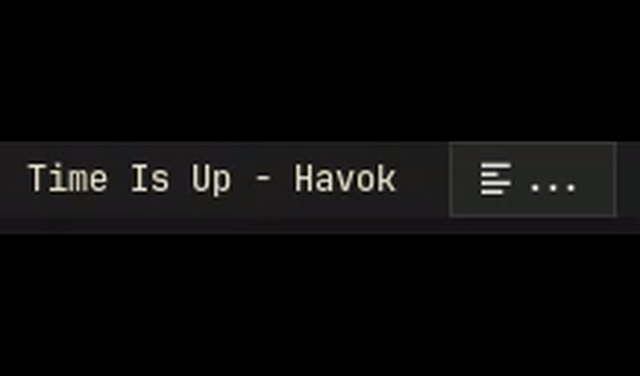

# yamusic-waybar-lyrics

[English](README.en.md) | [Русский](README.md)

Synced Yandex Music lyrics for Waybar.

> Disclosure: this module was coded with an AI coding agent, GPT-5.5, rather than written entirely by hand. Optimization may be imperfect.

The module reads MPRIS metadata/position, fetches LRC lyrics from Yandex Music, caches them on disk, and prints Waybar JSON. It can also seek to the next/previous lyric line with mouse wheel actions.

## Preview



## Animation Before First Line



## Features

- Direct Yandex Music LRC backend.
- MPRIS playback position from any compatible player/browser.
- In-memory cache while running.
- Persistent cache in `~/.cache/yamusic-waybar-lyrics/`.
- Negative cache for missing lyrics for 3 days.
- Tooltip with current line plus next 5 lines.
- Mouse wheel seek to next/previous lyric line.
- Default player target is Firefox, configurable with `MPRIS_PLAYER`.
- Optional `sptlrx` fallback for no-direct-lyrics cases.
- No token is stored in files or cache.

## Requirements

- Python 3.10+
- `dbus-python`
- Waybar
- Any player/browser exposing MPRIS metadata and position. Firefox is the default target.
- Yandex Music OAuth token for direct LRC lookup. The current track does not have to come from the Yandex Music web UI, but it must be matchable in Yandex Music for direct lyrics.
- `playerctl` for the example click actions
- Optional: `sptlrx` for fallback

On Arch/Arch-based systems:

```sh
sudo pacman -S python-dbus playerctl waybar
```

## Install

```sh
mkdir -p ~/.local/bin
curl -fsSL https://raw.githubusercontent.com/chm0d777/yamusic-waybar-lyrics/main/yamusic-waybar-lyrics -o ~/.local/bin/yamusic-waybar-lyrics
chmod +x ~/.local/bin/yamusic-waybar-lyrics
```

If you cloned or downloaded this repository, install the local file instead:

```sh
install -Dm755 yamusic-waybar-lyrics ~/.local/bin/yamusic-waybar-lyrics
```

`install -Dm755` copies the local `yamusic-waybar-lyrics` file, creates parent directories if needed, and marks the destination executable.

Set a Yandex Music OAuth token in your shell/session environment:

How to get a token:

- https://ym.marshal.dev/token/

```sh
export YANDEX_TOKEN='your-token-here'
```

Do not commit tokens. Do not put real tokens into this repository.

## Waybar

Add `custom/lyrics` to your Waybar modules and use the snippet from `examples/waybar-config.jsonc`.

```jsonc
"custom/lyrics": {
    "return-type": "json",
    "format": "{}",
    "hide-empty-text": true,
    "exec": "~/.local/bin/yamusic-waybar-lyrics",
    "on-click": "playerctl play-pause",
    "on-click-right": "playerctl next",
    "on-click-middle": "playerctl previous",
    "on-scroll-up": "~/.local/bin/yamusic-waybar-lyrics seek next",
    "on-scroll-down": "~/.local/bin/yamusic-waybar-lyrics seek prev"
}
```

For a non-Firefox MPRIS player, prefix the command with `MPRIS_PLAYER`. Example:

```jsonc
"exec": "MPRIS_PLAYER=chromium ~/.local/bin/yamusic-waybar-lyrics"
```

Add the CSS from `examples/waybar-style.css` or adapt it to your theme.

Restart Waybar after changes.

## Controls

- Left click: play/pause
- Right click: next track
- Middle click: previous track
- Scroll up: seek to next lyric line
- Scroll down: seek to previous lyric line

## Cache

Lyrics are cached by Yandex `track_id:album_id` in:

```text
~/.cache/yamusic-waybar-lyrics/
```

Positive cache entries are kept indefinitely. Missing-lyrics entries expire after 3 days.

Cache files contain track metadata and lyric timestamps/text only.

## Privacy

The script reads `YANDEX_TOKEN` from the process environment at runtime. It never prints it and never writes it to disk.

## Honorable Mentions

- [MarshalX/yandex-music-api](https://github.com/MarshalX/yandex-music-api) for documenting and implementing the unofficial Yandex Music API behavior this module relies on.
- [sptlrx](https://github.com/raitonoberu/sptlrx) as the inspiration/fallback path for synced lyrics in terminal/status-bar workflows.

## License

GPL-3.0-or-later.

Canonical references:

- https://www.gnu.org/licenses/gpl-3.0.txt
- https://spdx.org/licenses/GPL-3.0-or-later.html
